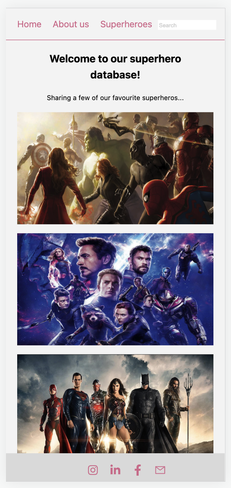
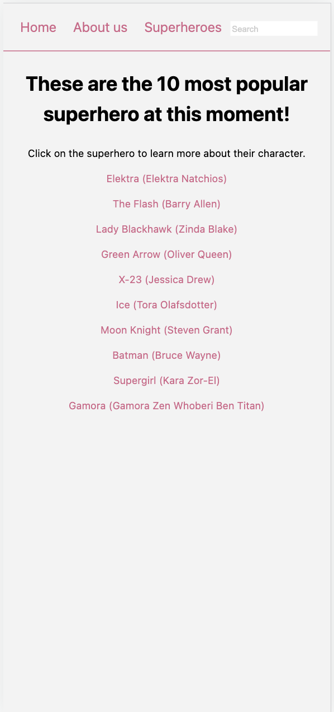
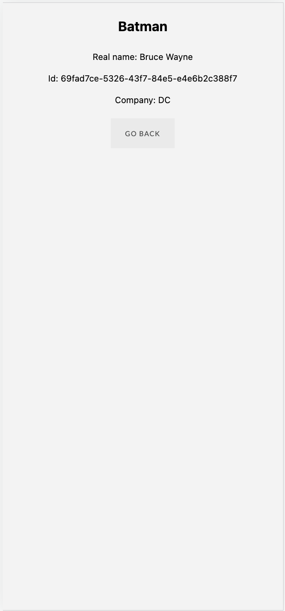
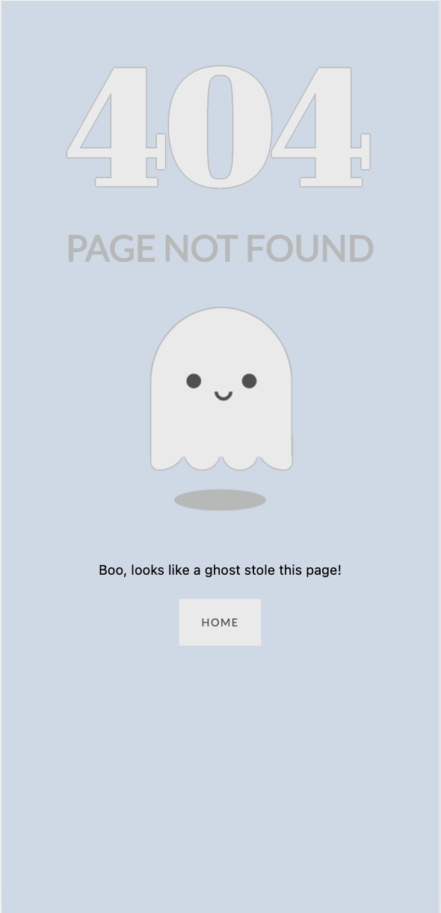

# Superher-database

Responsive layout for mobile

Responsive layout for desktop

### Tools used in this project

### Conventional Commits

In this project I used the following conventional commits:

1. 🐛 fix: a bug fix
2. ✨ feat: a new feature
3. 📦 refactor: a code change that neither fixes a bug nor adds a feature
4. 📚 docs: documentation only changes
5. 🗑 reverts: reverts a previous commit
